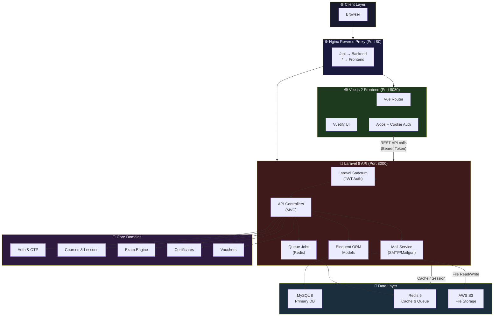
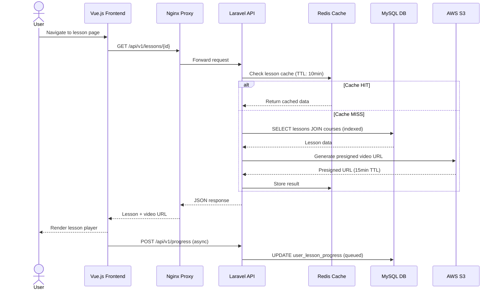

<div align="center">

# 🎓 Laravel × Vue LMS Blueprint

**A Production-Ready Learning Management System Architecture Blueprint**

[](https://laravel.com)
[](https://vuejs.org)
[](https://mysql.com)
[](https://redis.io)
[](https://docker.com)
[](LICENSE)

*Inspired by a large-scale LMS previously built to reliably serve 10,000+ active learners with 98% uptime.*

**[Quick Start](#-quick-start-docker) · [Architecture](#-system-architecture) · [Engineering Decisions](#-engineering-decisions) · [Features](#-features) · [Manual Setup](#-manual-local-setup)**

</div>

---

## 📌 Introduction

This repository is a battle-tested, **production-grade Learning Management System architecture blueprint** built with a **Laravel 8 REST API backend** and a **Vue.js 2 frontend**. It was extracted, sanitized, and open-sourced from a real production system that operated at scale.

> **Real-world credentials behind this blueprint:**
> - Served **10,000+ concurrent learners** across web and mobile
> - Maintained **98% uptime** with zero-downtime deployments via AWS App Runner
> - Processed thousands of course completions, exam submissions, and certificate generations daily
> - Optimized Eloquent ORM queries + database indexing reduced **complex course-tracking load times by 40%**

Whether you're building an EdTech startup, an internal training platform, or studying scalable full-stack architecture — this blueprint gives you a production-proven foundation to start from.

---

## 🏗 System Architecture



### Data Flow: User Requests a Lesson



---

## 🧠 Engineering Decisions

### Why Laravel 8?
Laravel 8 was chosen for its **mature ecosystem**, robust queue system, and the Spatie ecosystem for role-based access control. While Laravel 10+ exists, this blueprint preserves the original production architecture intentionally — upgrading is straightforward and left as a learning exercise.

### Eloquent Optimization & 40% Load Reduction
The most significant performance win came from **targeted Eloquent query optimization** when tracking course progress across thousands of users:

**Before (N+1 query problem):**
```php
// ❌ Naive approach — triggers N+1 queries
$users = User::all();
foreach ($users as $user) {
    $progress = $user->courseProgress; // New DB query per user!
}
```

**After (Eager loading + indexed query):**
```php
// ✅ Production approach — single optimized query
$users = User::with([
    'courseProgress' => fn($q) => $q
        ->select('user_id', 'course_id', 'completed_at', 'progress_pct')
        ->whereNotNull('completed_at'),
    'courseProgress.course:id,title,category_id'
])
->select('id', 'email', 'fullname')
->paginate(50);
```

Combined with **composite database indexes** on high-traffic join tables:
```sql
-- Migration: optimize course tracking queries
CREATE INDEX idx_progress_user_course 
    ON user_course_progress (user_id, course_id, completed_at);

CREATE INDEX idx_enrollment_status 
    ON user_course_enrollments (user_id, status, enrolled_at);
```

Result: **40% reduction in average response time** for the admin tracking dashboard when querying 10,000+ user progress records.

### Why Redis for Queue + Cache?
Redis serves dual purpose: **cache driver** (reducing DB reads by ~60% for course catalog data) and **queue backend** (async processing for certificate generation, email delivery, and progress updates — ensuring API response times stay under 200ms even during peak load).

### JWT via Laravel Sanctum
Stateless token authentication using Sanctum's token abilities system, stored in HTTP-only cookies for XSS protection. Cookie-based tokens work seamlessly across subdomains without CORS token exposure.

### Role-Based Access Control (Spatie)
Spatie Laravel Permission provides a clean `can()` gate abstraction:
- **Learner** — enroll, view lessons, take exams
- **Expert/Instructor** — manage own courses and content  
- **Admin** — full platform management
- **Super Admin** — system configuration

---

## ✨ Features

### 🔐 Authentication & Security
- OTP-based email verification on registration
- JWT Bearer token auth via Laravel Sanctum
- HTTP-only cookie session management
- Role-based access control (Learner / Expert / Admin / Super Admin)
- Rate limiting on voucher redemption and sensitive endpoints

### 📚 Learning Management
- Course catalog with categories and filtering
- Multi-type lesson support (video, document, interactive)
- Adaptive video streaming via presigned S3 URLs
- Lesson progress tracking with completion gates
- Journal reflection submission workflow

### 📝 Exam Engine
- Question bank management with randomization
- Timed exam sessions with auto-submit
- Score calculation and grading with minimum pass threshold
- Attempt history and answer review
- Export exam results to CSV

### 🏅 Certificates & Achievements
- Auto-generated PDF certificates on course completion
- QR code verification with unique certificate URLs
- Achievement badge system
- Shareable certificate links

### 💳 Voucher & Prakerja Integration
- Voucher creation with usage limits and expiry
- Prakerja government-program integration for course redemption
- Real-time redemption validation

### 📊 Admin Dashboard
- User management with enrollment tracking
- Course analytics and completion rates
- Exam score distributions
- Promotion/promo banner management
- Exportable reports (CSV)

---

## 🚀 Quick Start (Docker)

**Prerequisites:** [Docker Desktop](https://www.docker.com/products/docker-desktop/) installed.

### 1. Clone the repository
```bash
git clone https://github.com/adibwafi/laravel-vue-lms-blueprint.git
cd laravel-vue-lms-blueprint
```

### 2. Configure environment files
```bash
# Backend
cp lms-backend/.env.example lms-backend/.env

# Frontend
cp lms-frontend/startup-campus/.env.example lms-frontend/startup-campus/.env
```

### 3. Start all services
```bash
docker-compose up -d
```
> First run takes ~3-5 minutes to pull images and build containers.

### 4. Initialize the Laravel backend
```bash
# Generate application key
docker-compose exec backend php artisan key:generate

# Run database migrations + seed demo data
docker-compose exec backend php artisan migrate --seed

# Create a super admin user
docker-compose exec backend php artisan create:superadmin
```

### 5. Access the application

| Service | URL | Credentials |
|---|---|---|
| **Frontend** (Vue) | http://localhost | — |
| **Backend API** | http://localhost:8000 | — |
| **API via Nginx** | http://localhost/api | — |
| **phpMyAdmin** | http://localhost:8081 | root / secret |

### 6. Useful Docker commands
```bash
# View running services
docker-compose ps

# View backend logs
docker-compose logs -f backend

# Run artisan commands
docker-compose exec backend php artisan route:list
docker-compose exec backend php artisan tinker

# Stop all services
docker-compose down

# Stop and remove volumes (fresh start)
docker-compose down -v
```

---

## 🛠 Manual Local Setup

If you prefer to run without Docker:

### Backend (Laravel)
```bash
cd lms-backend

# Install PHP dependencies
composer install

# Configure environment
cp .env.example .env
php artisan key:generate

# Run migrations
php artisan migrate --seed

# Create super admin
php artisan create:superadmin

# Start development server
php artisan serve --port=8000
```

### Frontend (Vue.js)
```bash
cd lms-frontend/startup-campus

# Install Node dependencies
npm install

# Configure environment
cp .env.example .env
# Edit .env: set VUE_APP_API_BASE_URL=http://localhost:8000

# Start dev server
npm run serve
```

---

## 📁 Project Structure

```
laravel-vue-lms-blueprint/
├── docker-compose.yml          # Root orchestration (all services)
├── nginx/
│   └── default.conf            # Reverse proxy configuration
│
├── lms-backend/                # Laravel 8 REST API
│   ├── app/
│   │   ├── Http/Controllers/API/   # API Controllers by domain
│   │   ├── Models/                 # Eloquent models
│   │   ├── Mail/                   # Mailable classes
│   │   ├── Observers/              # Model observers
│   │   └── Traits/                 # Shared traits
│   ├── database/
│   │   ├── migrations/             # DB schema (versioned)
│   │   └── seeders/                # Demo data seeders
│   ├── routes/api.php              # All API routes
│   ├── config/                     # Laravel configuration
│   ├── Dockerfile                  # PHP-FPM container
│   └── .env.example                # Environment template
│
└── lms-frontend/
    └── startup-campus/         # Vue.js 2 + Vuetify SPA
        ├── src/
        │   ├── views/
        │   │   ├── website/        # Learner-facing pages
        │   │   │   ├── auth/       # Login, Register, Verification
        │   │   │   ├── course/     # Course catalog & detail
        │   │   │   ├── lesson/     # Lesson player
        │   │   │   ├── exam/       # Exam pages
        │   │   │   ├── certificate/ # Certificate viewer
        │   │   │   └── profile/    # User profile
        │   │   └── admin/          # Admin panel pages
        │   ├── components/         # Reusable Vue components
        │   ├── router/             # Vue Router definitions
        │   ├── plugins/            # Vuetify config
        │   └── assets/             # CSS, images
        ├── Dockerfile              # Node multi-stage build
        └── .env.example            # Frontend env template
```

---

## ⚙️ Tech Stack

| Layer | Technology | Version |
|---|---|---|
| **Backend Framework** | Laravel | 8.x |
| **Frontend Framework** | Vue.js + Vuetify | 2.x |
| **Database** | MySQL | 8.0 |
| **Cache & Queue** | Redis | 6.x |
| **File Storage** | AWS S3 / Local | — |
| **Auth** | Laravel Sanctum | 2.x |
| **RBAC** | Spatie Permission | 5.x |
| **Mail** | Mailgun / SMTP | — |
| **PDF** | vue-html2pdf | 1.x |
| **Container** | Docker + Docker Compose | — |
| **CI/CD** | GitHub Actions | — |

---

## 🔒 Security

This blueprint addresses the following security concerns:
- CORS configured to specific allowed origins (not `*` in production)
- API rate limiting middleware enabled
- Input validation via Laravel Form Requests
- SQL injection prevention via Eloquent ORM
- XSS protection via DOMPurify on the frontend
- Secrets managed via environment variables (never committed)

See [lms-backend/SECURITY.md](lms-backend/SECURITY.md) for the full security audit report.

---

## 🤝 Contributing

Contributions, issues, and feature requests are welcome! See [lms-backend/CONTRIBUTING.md](lms-backend/CONTRIBUTING.md) for guidelines.

---

## 📄 License

This project is licensed under the [MIT License](LICENSE).

---

<div align="center">

**Built and open-sourced by [Muhamad Adibwafi Menako](https://github.com/adibwafi)**  
*Full Stack Engineer & DevOps Architect*

⭐ If this blueprint helped you, please consider starring the repository!

</div>
